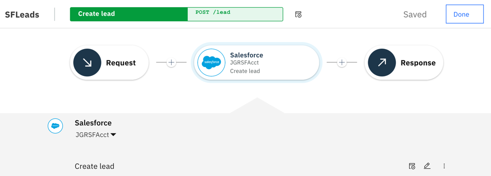
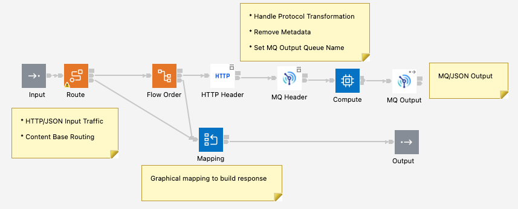
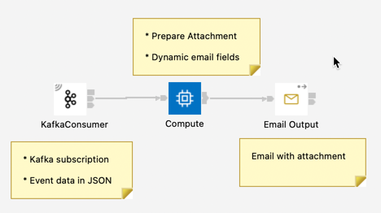
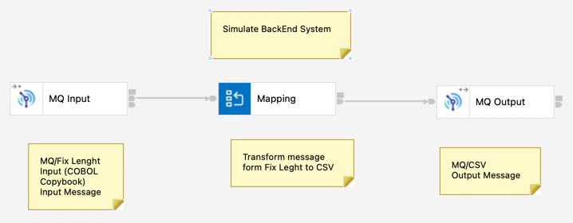

# App Connect assets for CP4I Demonstration

This Repo contains multiple App Connect assets (a.k.a. BAR files) to be used as part of an end-to-end CP4I demonstration.

* **SFLeads** is an Integration developed using the Designer Authoring Tool showcasing the SalesForce Smart Connector. This is how the flow looks like:

* **jgr-cp4i-mqapi-prem** is an Integration that exposes an MQ Queue as a REST API. Integration *jgr-cp4i-mqapi-dflt* is the same but using a different Output Queue. The contract can be found [here](https://github.com/gomezrjo/cp4idemo/blob/main/artifacts/jgr-cp4i-mqapi-prem.json). And this is how the flow looks like:

* **jgr-cp4i-fwdmq-event** is an Integration that gets the MQ message produced by the previous flow and forwards it to another queue doing message transformation and protocol conversion to kafka. The json schema used in the input messabe can be found [here](https://github.com/gomezrjo/cp4idemo/blob/main/artifacts/contact.json), and the COBOL copy book with the format for the back end system is located [here](https://github.com/gomezrjo/cp4idemo/blob/main/artifacts/contact.cpy). And this is how the flow looks like:

* **jgr-cp4i-kafka2mail** is an Integration that is subscribed to a Kafka Topic and using that information to send an email with an attachment. The integration uses an UDP to get the information to be used by the Email Output node. This is how the flow looks like:

* **jgr-cp4i-mock-backend** is an Integration that simulate the Back End system that process the request message. This is how the flow looks like:

